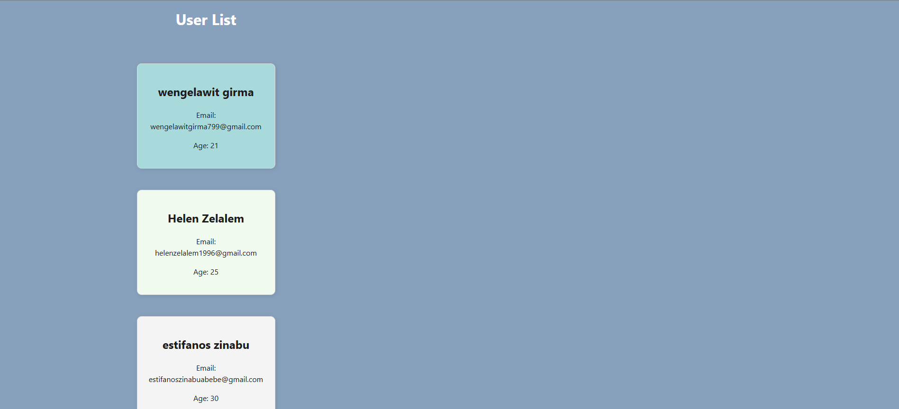

# Task 1: UserCard React Project

This is a simple React project built using Vite to demonstrate the use of props. The app features a reusable UserCard component that displays user details, including:
- ✅ **Name**
- ✅ **Email**
- ✅ **Age**
- ✅ **Custom background color** (optional)
# UI Preview

# Task 2: Counter App 🧮
A simple React Counter Application built with useState to manage the count.
It includes buttons for:
- ✅ **Incrementing the count**
- ✅ **Decrementing the count** (disabled at 0)
- ✅ **Resetting the count**
# UI Review

